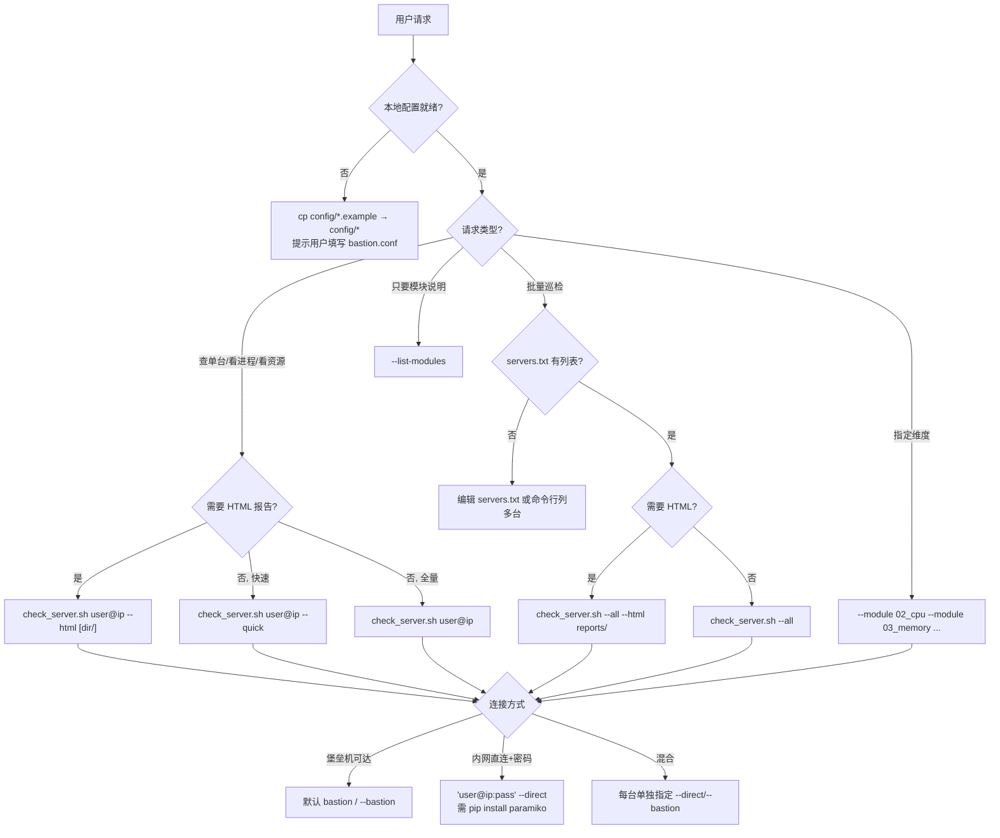

# JumpServer 堡垒机服务器监控

## Overview

通过 SSH 连接目标服务器执行 5 大模块的全面健康检查。默认经 JumpServer 堡垒机 ProxyJump 穿透内网；本机网络可达时可用 `--direct` 直连。

## 目录结构

```
jumpserver-monitor/
├── SKILL.md
├── config/
│   ├── bastion.conf.example   # 堡垒机配置模板（复制为 bastion.conf）
│   ├── servers.txt.example    # 批量巡检列表模板（复制为 servers.txt）
│   ├── bastion.conf           # 本地配置（勿提交 Git）
│   └── servers.txt            # 本地列表（勿提交 Git，勿写明文密码）
└── scripts/
    ├── check_server.sh    # 主入口（接受 user@ip 或 --all）
    ├── utils/
    │   ├── remote_exec.sh       # 核心：ProxyJump 连接函数
    │   ├── gen_html.py          # HTML 报告 CLI 入口（委托 html_report 包）
    │   ├── gen_index.py         # 多台巡检目录页 index.html 生成器
    │   └── html_report/         # HTML 报告生成包
    │       ├── parsers.py       # 模块输出解析
    │       ├── renderers.py     # 卡片与页面渲染
    │       ├── thresholds.py    # 阈值、配色、知识库
    │       ├── gen_html.py      # 包内 CLI 实现
    │       └── templates/       # report.css、tabs.js
    └── modules/
        ├── 02_cpu.sh         # CPU 与负载
        ├── 03_memory.sh      # 内存与 Swap
        ├── 04_disk.sh        # 磁盘、Inode、IO
        ├── 05_process.sh     # 进程分析
        └── 06_network.sh     # 网络与端口
```

## 配置文件

> **安全提示**：`bastion.conf` 与 `servers.txt` 含内网地址、账号或密码，已加入 `.gitignore`。**切勿提交到 Git**。首次使用从 `.example` 模板复制后本地填写。

```bash
cp config/bastion.conf.example config/bastion.conf
cp config/servers.txt.example config/servers.txt
# 编辑上述两个文件，填入实际参数
```

### `config/bastion.conf`

连接参数；`SSH_CONNECT_MODE` 为**未单独指定**目标的默认模式：

```bash
# 默认连接模式：bastion（堡垒机）| direct（直连）
SSH_CONNECT_MODE="bastion"

BASTION_HOST="YOUR_BASTION_HOST"
BASTION_PORT="60022"
BASTION_USER="your.username"
SSH_OPTS="..."
```

**按目标指定连接方式**（优先级高于默认）：

| 场景 | 写法 |
|------|------|
| 命令行指定该台直连 | `'root@172.18.4.152:pass' --direct` |
| 命令行指定该台堡垒机 | `root@172.16.202.92 --bastion` |
| servers.txt 指定 | `@direct root@172.18.4.152:pass` |
| 含密码未指定模式 | 自动使用直连 |
| 普通 `user@ip` | 使用 `SSH_CONNECT_MODE` 默认 |

```bash
# 混合：一台堡垒机 + 一台直连
bash scripts/check_server.sh root@172.16.202.92 'root@172.18.4.152:pass' --direct

# 批量（servers.txt 内可混用 @direct 与普通行）
bash scripts/check_server.sh --all
```

### `config/servers.txt`

批量巡检时的服务器列表，格式 `user@ip`，`#` 开头为注释：

```
# 格式: user@ip
ops@172.18.0.245
root@172.16.202.92
```

## 使用方式

### 单台全量检查（全部 5 个模块）

```bash
bash scripts/check_server.sh root@172.16.202.92
```

### 单台快速检查（5 模块精简子项）

跳过 mpstat、vmstat、进程/内存 Top5、连接状态摘要等耗时采集，适合日常快速扫一眼：

```bash
bash scripts/check_server.sh root@172.16.202.92 --quick
```

> 说明：`--html` 生成报告时**始终全量采集**（5 模块完整子项），与是否加 `--quick` 无关。

### 单台指定模块检查

```bash
# 只查 CPU 和内存
bash scripts/check_server.sh root@172.16.202.92 --module 02_cpu --module 03_memory

# 查看模块编号对应关系: 02=cpu, 03=memory, 04=disk, 05=process, 06=network
```

### 多台服务器生成 HTML 报告（推荐）

一次巡检多台机器，**每台 IP 独立 HTML 报告**，并在同一目录下自动生成 **`index.html` 目录页**：

```bash
# 命令行指定多台（每台 report_<IP>.html + index.html）
bash scripts/check_server.sh dev@172.18.100.170 dev@172.18.100.171 --html reports/

# 从 servers.txt 批量（同上）
bash scripts/check_server.sh --all --html reports/

# 快速模式 + HTML
bash scripts/check_server.sh dev@172.18.100.170 dev@172.18.100.171 --quick --html reports/
```

输出目录结构示例：

```
reports/run_20260626_083000/
├── index.html                      # 目录页，汇总所有服务器及链接
├── report_172.18.100.170.html      # 单 IP 独立报告
├── report_172.18.100.171.html
└── manifest.json                   # 批量元数据（供 index 生成使用）
```

### 单台生成 HTML 报告

```bash
# 自动生成报告文件名（含 IP 和时间）
bash scripts/check_server.sh root@172.16.202.92 --html

# 指定输出文件名
bash scripts/check_server.sh root@172.16.202.92 --html report.html

# 快速检查 + HTML 报告
bash scripts/check_server.sh root@172.16.202.92 --quick --html
```

### 批量生成 HTML 报告

与「多台服务器生成 HTML 报告」相同，读取 `config/servers.txt` 执行批量巡检，每台 IP 独立报告 + `index.html` 目录页。

```bash
bash scripts/check_server.sh --all --html reports/
bash scripts/check_server.sh --all --quick --html reports/
```

> HTML 报告特性：
> - 📑 **Tab 页布局**：每个检查模块独立 Tab，点击切换，Tab 旁 ● 显示模块状态
> - 📂 **多台巡检目录页**：批量/多台 `--html` 时自动生成 `index.html`，汇总各 IP 报告链接
> - 📊 深色主题，指标卡片式布局
> - 💡 每个指标附有通俗解释，非专业人士也能看懂
> - 📋 表格精简，只展示关键列（PID/进程名/CPU%/MEM%）
> - 🟢🟡🔴 状态指示灯（正常/警告/异常）
> - 📋 报告头部显示服务器 IP、主机名、检查时间

### 列出所有可用模块

```bash
bash scripts/check_server.sh --list-modules
```

### 批量巡检（读取 `config/servers.txt`）

```bash
bash scripts/check_server.sh --all
bash scripts/check_server.sh --all --quick          # 批量+快速模式
bash scripts/check_server.sh --all --module 02_cpu  # 批量+指定模块
```

## 5 大检查模块说明

| 模块 | 文件 | 关键指标 |
|------|------|----------|
| 02 CPU/负载 | `02_cpu.sh` | CPU 使用率分布(us/sy/ni/id/wa/hi/si/st)，含阈值/含义/排查建议 |
| 03 内存 | `03_memory.sh` | 内存总览(free)、使用率百分比、Swap状态、高内存进程Top5 |
| 04 磁盘 | `04_disk.sh` | 磁盘使用率(df -hP)、Inode(df -iP)、高使用率挂载点(df 筛选，无 du) |
| 05 进程 | `05_process.sh` | 进程统计、僵尸详情、CPU/内存 Top5 |
| 06 网络 | `06_network.sh` | 网络接口(ip)、监听端口(ss，缺 Process/PID 时按需 sudo)、连接统计 |

## 非 root 账号与 sudo 提权

监听端口的 Process/PID 需要更高权限时，脚本采用**按需提权**策略：

1. **先用当前账号**执行 `ss -tlnp`（或 `netstat -tlnp`）
2. 若输出已含 Process/PID，**不再提权**
3. 若已是 **root**，直接输出，不调用 sudo
4. 仅当**非 root 且输出缺少 Process/PID** 时，才依次尝试：
   - `sudo -n -i bash -c`（免密 sudo 切换 root 环境）
   - 失败则 `sudo -n bash -c`
   - 仍失败则**降级**为普通账号继续（Process/PID 可能为空）

其他模块（CPU/内存/磁盘/进程）不涉及提权。无需人工输入密码。

每个指标在 HTML 报告中均附有 💡 详细解释，说明指标含义、正常范围和异常处理建议。

## 连接方式

| 模式 | 配置/写法 | 说明 |
|------|-----------|------|
| **默认** | `bastion.conf` → `SSH_CONNECT_MODE` | 未单独指定的目标使用此模式 |
| **单台指定** | 地址后接 `--direct` / `--bastion` | 仅作用于**紧邻的前一个**目标 |
| **列表指定** | `@direct user@ip:pass` | 用于 `servers.txt` |
| **密码自动直连** | `user@ip:password` | 未写 `@direct` 时含密码也会直连 |

密码格式 `user@ipv4:password` 仅用于直连；含 `$` 等特殊字符请用单引号。**避免在 servers.txt 中明文存储密码**；优先 SSH 密钥，必要时用命令行临时传入。

Windows 下密码登录推荐安装 **paramiko**（`pip install paramiko`），脚本会优先用它自动传密码，避免 SSH 交互式提示。密码写入临时文件并在进程退出时自动清理（`trap EXIT`）。

## 为什么用 ProxyJump 而非 GateShell TUI

JumpServer 的 GateShell 交互界面在管道/脚本中不可靠：

- `echo ":ssh ops@172.18.0.245" | ssh ...` 会把 `:s` 截获为 GateShell 的排序快捷键
- 导致实际连接到错误的服务器
- 本 skill 使用 SSH `ProxyCommand` 方式，绕开 GateShell TUI，直接穿透到目标服务器

## Agent 工作流

Agent 收到巡检/查服务器相关请求时，**先读本 SKILL 与本地配置**，再执行脚本；不要凭空猜测 IP、账号或连接方式。

### 决策树



### 执行前检查清单

| 步骤 | 动作 |
|------|------|
| 1 | 确认 `config/bastion.conf` 存在（无则从 `.example` 复制） |
| 2 | 批量模式确认 `config/servers.txt` 存在且非空 |
| 3 | 密码直连时确认 `paramiko` 已安装 |
| 4 | 在 skill 根目录执行：`bash scripts/check_server.sh ...` |
| 5 | HTML 模式需 Python 3；Windows 优先使用本机已配置的 Python |

### 命令速查

| 用户意图 | 推荐命令 |
|----------|----------|
| 看一台服务器现状（终端） | `bash scripts/check_server.sh user@ip` |
| 快速扫一眼（终端） | `bash scripts/check_server.sh user@ip --quick` |
| 单台 HTML 报告 | `bash scripts/check_server.sh user@ip --html` |
| 多台 HTML + 目录页 | `bash scripts/check_server.sh ip1 ip2 --html reports/` |
| 批量 HTML 巡检 | `bash scripts/check_server.sh --all --html reports/` |
| 只看 CPU+内存 | `bash scripts/check_server.sh user@ip --module 02_cpu --module 03_memory` |

### 故障排查

#### 连接失败

| 现象 | 可能原因 | 处理 |
|------|----------|------|
| `连接失败` + 堡垒机模式 | 堡垒机地址/端口/用户错误，或 SSH 密钥未授权 | 检查 `bastion.conf`；本机 `ssh -p PORT user@BASTION` 能否登录 |
| `连接失败` + 直连 | 本机网络不可达目标 IP | 确认 VPN/内网；改用 `--bastion` |
| `找不到配置文件` | 未复制模板 | `cp config/bastion.conf.example config/bastion.conf` |
| `密码登录需要 paramiko` | 直连密码模式缺依赖 | `pip install paramiko` |
| 连错机器（GateShell） | 误用交互式 JumpServer TUI | **必须**用本 skill 的 ProxyCommand，勿管道 `:ssh` 命令 |

#### 采集异常

| 现象 | 可能原因 | 处理 |
|------|----------|------|
| 监听端口无 Process/PID | 非 root 且 sudo 不可用 | 正常降级；换 root 或配置免密 sudo |
| 模块输出 `[采集失败]` | 目标机缺命令（mpstat/ss 等） | 安装 sysstat/iproute；或忽略该子项 |
| `[quick] 已跳过` | 使用了 `--quick` | 预期行为；要完整数据去掉 `--quick` 或用 `--html` |
| `write_host_entry: Permission denied` | Windows OpenSSH 写 known_hosts 失败 | 可忽略；不影响采集结果 |

#### HTML 报告

| 现象 | 可能原因 | 处理 |
|------|----------|------|
| `未找到 Python` | 无 python3 | 安装 Python 3 或配置 `JUMPSERVER_PYTHON` 环境变量 |
| `未找到 gen_html.py` | 路径错误 | 在 skill 根目录执行；勿移动 `scripts/utils/` 结构 |
| 报告空白/缺模块 | SSH 中断或模块脚本失败 | 先看终端 `[ERROR]`；单模块重跑 `--module XX` |
| index.html 某台显示失败 | 该台连接失败 | 看 index 失败表；单独测试 `test_connection` 目标 |

#### 安全提醒（Agent 必遵）

- **不要**将含密码的 `servers.txt` 提交 Git 或写入回复
- **不要**在对话中回显用户密码；报告/HTML 中亦无需暴露凭据
- 密码优先命令行临时传入：`bash scripts/check_server.sh 'user@ip:pass' --direct`

## 手动在目标服务器执行自定义命令

**经堡垒机**（替换为 `bastion.conf` 中的实际参数）：

```bash
ssh -o StrictHostKeyChecking=no -o ConnectTimeout=10 \
    -o ProxyCommand="ssh -p 60022 your.username@YOUR_BASTION_HOST -W %h:%p" \
    root@TARGET_IP "your_command_here"
```

**直连：**

```bash
ssh -o StrictHostKeyChecking=no -o ConnectTimeout=10 \
    root@172.16.202.92 "your_command_here"
```

## 首次使用前置条件

1. 确认 `~/.ssh/id_rsa` 私钥已配置（堡垒机模式还需密钥已添加到 JumpServer）
2. 复制并编辑配置：`cp config/bastion.conf.example config/bastion.conf`（填入堡垒机参数）
3. （可选）复制并编辑：`cp config/servers.txt.example config/servers.txt`（批量巡检列表，勿提交 Git）
